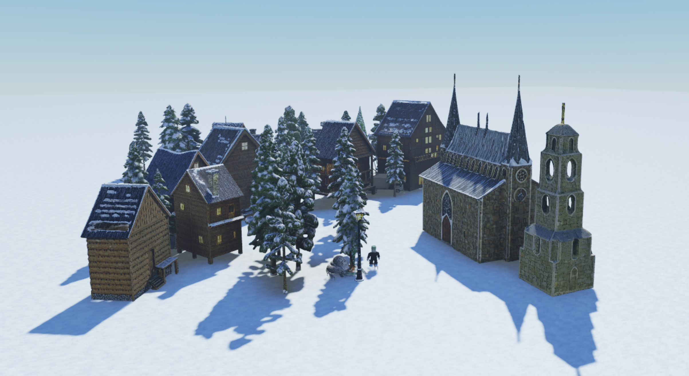

# new-cube: Generative AI System for 3D

> A custom fork maintained by [@cipher-rc5](https://github.com/cipher-rc5), based on
> Roblox's [Cube](https://github.com/Roblox/cube) (released under the license in
> [`LICENSE`](./LICENSE)). Model weights are still hosted on Hugging Face under `Roblox/`.

<p align="center">
  
</p>


Foundation models trained on vast amounts of data have demonstrated remarkable reasoning and
generation capabilities in the domains of text, images, audio and video. Our goal is to build
such a foundation model for 3D intelligence, a model that can support developers in producing all aspects
of a Roblox experience, from generating 3D objects and scenes to rigging characters for animation to
producing programmatic scripts describing object behaviors. As we start open-sourcing a family of models 
towards this vision, we hope to engage others in the research community to address these goals with us.

## May 2026 Update: CubePart 

<div align="left">
  <a href="https://cubepart.github.io/" target="_blank"></a>
  <a href="https://arxiv.org/abs/2605.28763" target="_blank"></a>
  <a href="https://huggingface.co/Roblox/cubepart" target="_blank"></a>
  <a href="https://huggingface.co/spaces/Roblox/cubepart-demo" target="_blank"></a>
</div>

https://github.com/user-attachments/assets/bafcad1d-6846-4db3-b176-e079e2c84f32

We have released CubePart,  an **open-vocabulary, part-controllable** 3D generator. Given an input mesh and a user-defined parts schema, CubePart synthesizes a set of meshes—one per schema element—that assemble into a coherent object while respecting the
specified semantic structure. The resulting assets can be directly integrated into game engines and driven by animation, physics, and behavior scripts without manual post-processing.

Check out more details [here](https://github.com/Roblox/cube/tree/main/cubepart)!

## July 2025 Update: Cube 3D v0.5 ✨

<div align="left">
  <a href=https://arxiv.org/abs/2503.15475 target="_blank"></a>
  <a href=https://huggingface.co/Roblox/cube3d-v0.5 target="_blank"></a>
  <a href=https://huggingface.co/spaces/Roblox/cube3d-interactive target="_blank"></a>
  <a href=https://colab.research.google.com/drive/1ZvTj49pjDCD_crX5WPZNTAoTTzL6-E5t target="_blank"></a>
</div>

With the v0.5 model, we introduce two upgrades to the auto-regressive base model for 3D geometry generation from text: *higher fidelity 3D compositions* and *bounding box conditioning*.
The example gif below shows the model's capacity to generate 3D shapes capturing mixtures of concepts expressed in text, for example *mechanical lobster with mechanical tank treads*. The v0.5 model also shows significantly better text adherence, for example the *lowpoly paper craft victorian rabbit*.  
<p align="center">
  
</p>

With bounding box conditioning, we observe novel 3D generations where the model balances between the two conditioning inputs -- text prompt and global aspect ratio. In the gif below, notice how the model creatively interprets the *seashell* or *tall pagoda* prompts into distinct 3D shapes. The model sometimes struggles when the bounding box is too extreme for a given prompt, for example the *cat*, where it can produce disconnected components or generates it along a diagonal to fit the bounding box constraints.
<p align="center">
  
</p>

For a technical overview of the methods behind these two improvements, please refer to our latest <a href=https://arxiv.org/abs/2503.15475 target="_blank">v3 report on arXiv</a>. The latest model was trained on an additional ~2.8 million synthetic 3D assets. We introduced several refinements to VQ-VAE architecture and training procedures, and increased the VQ-VAE latent length from 512 to 1024 to increase generation fidelity.

### Try it out on 
- [Hugging Face Interactive Demo](https://huggingface.co/spaces/Roblox/cube3d-interactive)
- [Google Colab](https://colab.research.google.com/drive/1ZvTj49pjDCD_crX5WPZNTAoTTzL6-E5t)

### Updated CLI Inference
Please follow the [install instructions](#install-requirements) below (from v0.1) to clone and install the repo. The main changes are new model weights, config (under ```./cube3d/config/```) and new args for specifying bounding box. We currently default to the v0.5 config that supports bounding box.
To generate 3D models using the downloaded models simply run:

```bash
uv run python -m cube3d.generate \
            --gpt-ckpt-path model_weights/shape_gpt.safetensors \
            --shape-ckpt-path model_weights/shape_tokenizer.safetensors \
            --fast-inference \
            --prompt "A tall pagoda" \
            --bounding-box-xyz 1.0 2.0 1.5
```
> **Note**: `--fast-inference` is optional and may not be available for all GPUs that have limited VRAM. It is CUDA-only and is ignored on macOS (generation falls back to the standard engine). 

The output will be an `.obj` file saved in the specified `output` directory.

## March 2025 Launch: Cube 3D v0.1

<div align="left">
  <a href=https://arxiv.org/abs/2503.15475 target="_blank"></a>
  <a href=https://huggingface.co/Roblox/cube3d-v0.5 target="_blank"></a>
  <a href=https://huggingface.co/spaces/Roblox/cube3d-interactive target="_blank"></a>
  <a href=https://colab.research.google.com/drive/1ZvTj49pjDCD_crX5WPZNTAoTTzL6-E5t target="_blank"></a>
</div>

Cube 3D is our first step towards 3D intelligence, which involves a shape tokenizer and a text-to-shape generation model. We are unlocking the power of generating 3D assets and enhancing creativity for all artists. Our latest version of Cube 3D is now accessible to individuals, creators, researchers and businesses of all sizes so that they can experiment, innovate and scale their ideas responsibly. This release includes model weights and starting code for using our text-to-shape model to create 3D assets.

### Install Requirements

This project uses [uv](https://docs.astral.sh/uv/) for environment and
dependency management and targets Python 3.14. Clone the repo and create the
environment via:

```bash
git clone https://github.com/cipher-rc5/new-cube.git
cd new-cube
uv python install 3.14.5
uv python pin 3.14.5
uv venv
uv sync --extra meshlab
```

On Apple Silicon you can additionally enable the optional MLX GPT-decode
backend (see [Apple Silicon (Metal / MPS)](#apple-silicon-metal--mps)):

```bash
uv sync --extra meshlab --extra mlx
```

Run any command in the environment with `uv run ...` (for example
`uv run python -m cube3d.generate ...`), which avoids having to activate the
virtualenv manually.

> **Python version**: `requires-python` is `==3.14.*`. If a native dependency
> lacks a `cp314` wheel on your platform (most commonly `pymeshlab` or
> `fpsample`), fall back to Python 3.13 with `uv python pin 3.13` and re-run
> `uv venv && uv sync`, dropping `--extra meshlab` if `pymeshlab` is the
> blocker. The `cubepart` subproject in particular may stay on 3.13 for this
> reason.

> **CUDA**: On Linux/Windows with an NVIDIA GPU, install the
> [CUDA](https://developer.nvidia.com/cuda-downloads) toolkit and a CUDA build
> of `torch`. The optional `cuda` extra (`uv sync --extra cuda`) pulls in
> `warp-lang` (Linux only) for accelerated marching cubes.

> **macOS**: Systems with Apple Silicon can leverage the Metal Performance
> Shaders (MPS) backend for PyTorch out of the box; see the dedicated section
> below.

> **Note**: `meshlab` is an optional extra. Omit `--extra meshlab` (run plain
> `uv sync`) for broader compatibility, but mesh simplification / postprocessing
> will be disabled.

### Apple Silicon (Metal / MPS)

On Apple Silicon Macs, Cube runs on the PyTorch MPS (Metal) backend. Set up the
environment with uv:

```bash
uv python install 3.14.5
uv python pin 3.14.5
uv venv
uv sync --extra meshlab
```

Verify that PyTorch can see the Metal backend:

```bash
uv run python -c "import torch; print('mps', torch.backends.mps.is_available())"
```

This should print `mps True`. The device is selected automatically at runtime
(`cuda` if available, else `mps`, else `cpu`).

> **MPS fallback**: a handful of ops are not yet implemented on MPS. If you hit
> a `NotImplementedError` for an MPS operator, set
> `PYTORCH_ENABLE_MPS_FALLBACK=1` to transparently run the missing op on the CPU
> while keeping the rest on the GPU:
> `PYTORCH_ENABLE_MPS_FALLBACK=1 uv run python -m cube3d.generate ...`

> **`--fast-inference` is CUDA-only**: it relies on CUDA graphs and the
> `EngineFast` engine. On a Mac the flag is accepted but ignored — generation
> falls back to the standard `Engine`.

> **`CUBE_MPS_AUTOCAST_DTYPE`**: the autocast / KV-cache dtype on MPS is
> controlled by this env var. The default is `bfloat16`; allowed values are
> `bfloat16`, `float16`, and `float32` (an unknown value falls back to
> `bfloat16` with a warning). This is the targeted escape hatch for the few MPS
> bf16 operator gaps — switch to `float16` or `float32` if a bf16 op is missing
> or numerically unstable on your macOS / PyTorch version, e.g.
> `CUBE_MPS_AUTOCAST_DTYPE=float32 uv run python -m cube3d.generate ...`.

> **Optional MLX backend (`--backend mlx`)**: Apple Silicon only. This opt-in
> backend runs the GPT decode loop on Apple's MLX framework while CLIP
> conditioning and shape decoding stay on PyTorch/MPS. It requires
> `uv sync --extra mlx`. The default backend is `torch`; pass `--backend mlx`
> to opt in. See [Code Usage](#code-usage) for the Python entry point.

### Download Models from Huggingface 🤗

Download the model weights from [hugging face](https://huggingface.co/Roblox/cube3d-v0.5) or use the
`hf` CLI (huggingface-hub 1.x; the old `huggingface-cli` command has been removed):

```bash
uv run hf download Roblox/cube3d-v0.5 --local-dir ./model_weights
```

### Inference

#### 1. Shape Generation

To generate 3D models using the downloaded models simply run:

```bash
uv run python -m cube3d.generate \
            --gpt-ckpt-path model_weights/shape_gpt.safetensors \
            --shape-ckpt-path model_weights/shape_tokenizer.safetensors \
            --fast-inference \
            --prompt "Broad-winged flying red dragon, elongated, folded legs."
```

> **Note**: `--fast-inference` is optional and may not be available for all GPUs that have limited VRAM. It is CUDA-only and is ignored on macOS (generation falls back to the standard engine). On Apple Silicon you may additionally pass `--backend mlx` (requires `uv sync --extra mlx`) to run the GPT decode loop on MLX; the default backend is `torch`. 

The output will be an `.obj` file saved in the specified `output` directory.

If you want to render a turntable gif of the mesh, you can use the `--render-gif` flag, which will render a turntable gif of the mesh
and save it as `turntable.gif` in the specified `output` directory. 

We provide several example output objects and their corresponding text prompts in the `examples` folder.

> **Note**: You must have Blender (version >= 4.3) installed and available in your system's PATH to render the turntable GIF. You can download it from [Blender's official website](https://www.blender.org/). Ensure that the Blender executable is accessible from the command line.

> **Note**: If shape decoding is slow, you can try to specify a lower resolution using the `--resolution-base` flag. A lower resolution will create a coarser and lower quality output mesh but faster decoding. Values between 4.0 and 9.0 are recommended.

#### 2. Shape Tokenization and De-tokenization

To tokenize a 3D shape into token indices and reconstruct it back, you can use the following command:

```bash
uv run python -m cube3d.vq_vae_encode_decode \
            --shape-ckpt-path model_weights/shape_tokenizer.safetensors \
            --mesh-path ./outputs/output.obj
```

This will process the `.obj` file located at `./outputs/output.obj` and prints the tokenized representation as well as exports the mesh reconstructed from the token indices.

### Hardware Requirements

We have tested our model on:
* Nvidia L40S GPU
* Nvidia H100 GPU
* Nvidia A100 GPU
* Apple Silicon M2-4 Chips.

We recommend using a GPU with at least 24GB of VRAM available when using `--fast-inference` (or `EngineFast`) and 16GB otherwise. 

### Code Usage

We have designed a minimalist API that allows the use this repo as a Python library:

```python
import torch
import trimesh
from cube3d.inference.engine import Engine, EngineFast

# load ckpt
config_path = "cube3d/configs/open_model.yaml"
gpt_ckpt_path = "model_weights/shape_gpt.safetensors"
shape_ckpt_path = "model_weights/shape_tokenizer.safetensors"
engine_fast = EngineFast( # only supported on CUDA devices, replace with Engine otherwise
    config_path, 
    gpt_ckpt_path, 
    shape_ckpt_path, 
    device=torch.device("cuda"), # Replace with "mps" on Metal-compatible devices
)

# inference
input_prompt = "A pair of noise-canceling headphones"
# NOTE: Reduce `resolution_base` for faster inference and lower VRAM usage
# The `top_p` parameter controls randomness between inferences:
#   Float < 1: Keep smallest set of tokens with cumulative probability ≥ top_p. Default None: deterministic generation.
mesh_v_f = engine_fast.t2s([input_prompt], use_kv_cache=True, resolution_base=8.0, top_p=0.9)

# save output
vertices, faces = mesh_v_f[0][0], mesh_v_f[0][1]
_ = trimesh.Trimesh(vertices=vertices, faces=faces).export("output.obj")
```

> **Apple Silicon MLX backend**: to run the GPT decode loop on MLX, install the
> `mlx` extra (`uv sync --extra mlx`) and use `MlxEngine` instead of `Engine`:
> `from cube3d.inference.mlx_engine import MlxEngine` then
> `engine = MlxEngine(config_path, gpt_ckpt_path, shape_ckpt_path)` (it composes
> a torch `Engine` on MPS internally). It mirrors the `Engine` public surface
> (`t2s`, `run_gpt`, `run_shape_decode`).

## Upcoming Features
- Texture generation
- Scene layout generation


## Citation
If you find this work helpful, please consider citing our technical report:

```bibtex
@article{roblox2025cube,
    title   = {Cube: A Roblox View of 3D Intelligence},
    author  = {Roblox, Foundation AI Team},
    journal = {arXiv preprint arXiv:2503.15475},
    year    = {2025}
}
```

## Acknowledgements

We would like to thank the contributors of [TRELLIS](https://github.com/microsoft/TRELLIS), [CraftsMan3D](https://github.com/wyysf-98/CraftsMan3D), [threestudio](https://github.com/threestudio-project/threestudio), [Hunyuan3D-2](https://github.com/Tencent/Hunyuan3D-2), [minGPT](https://github.com/karpathy/minGPT), [dinov2](https://github.com/facebookresearch/dinov2), [OptVQ](https://github.com/zbr17/OptVQ), [1d-tokenizer](https://github.com/bytedance/1d-tokenizer)
repositories, for their open source contributions.
